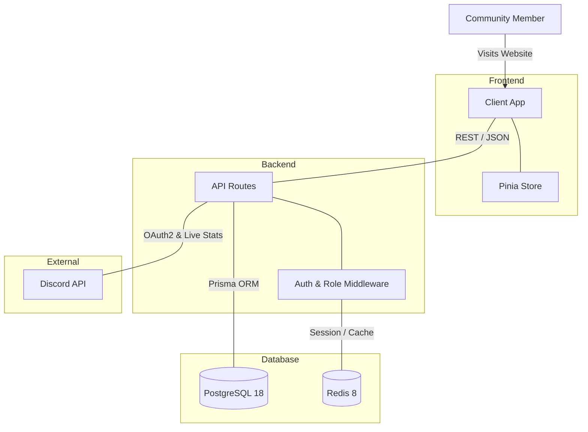
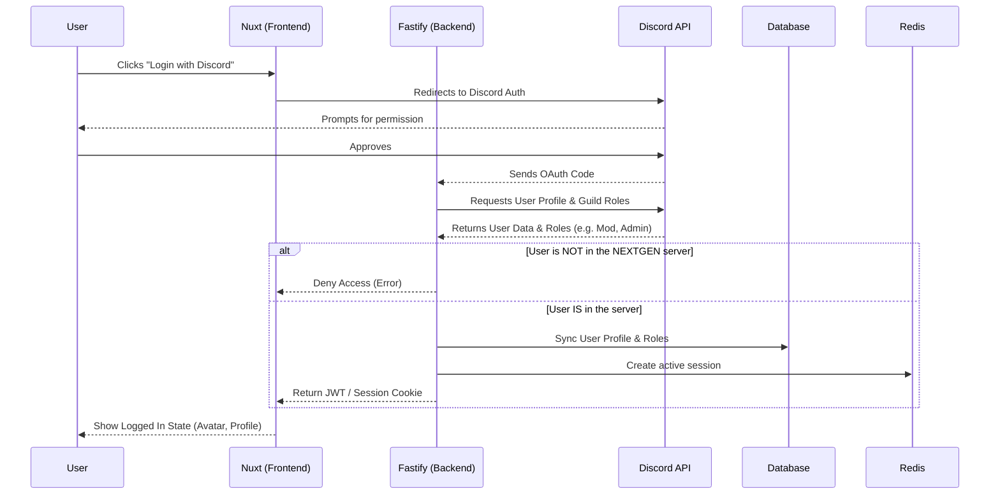
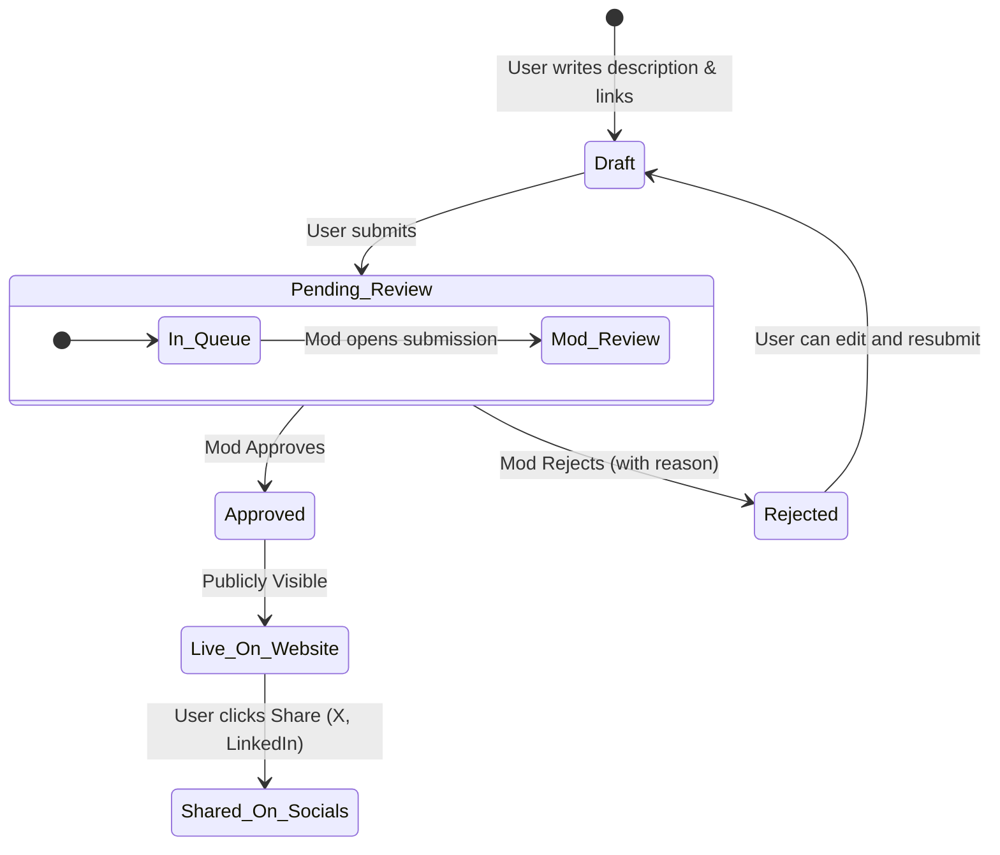

# NEXTGEN Platform Architecture & Product Spec

## 1. High-Level System Architecture

The NEXTGEN platform is designed using a modern decoupled architecture. The frontend (Nuxt) handles rendering and UI, while the backend (Fastify) acts as the secure gateway to the database and external APIs (like Discord).

## 2. Authentication & Authorization Flow

To verify that someone is actually a member of the NEXTGEN Discord server (and to automatically assign Mod/Admin rights), we will use **Discord OAuth2**. 

## 3. Project & Resource Submission Flow (Moderator Approval)

To keep the platform safe and high-quality, user submissions (Projects, Resources, Blogs) go into a "Pending" queue that only Moderators and Admins can approve.

## 4. Product Strategy: Engagement & Retention

To make people visit the platform frequently (more than just a standard landing page), we need **hooks** and **gamification**. Here are ideas to increase engagement:

### 1. Gamification & Leaderboards
- **Reputation Points (XP)**: Users earn points when their projects/resources get approved, or when other members "Upvote" their projects.
- **Monthly Leaderboard**: Display the top 10 most active or highly-upvoted contributors on the homepage.
- **Discord Role Sync**: If someone reaches a certain level of points on the website, the Fastify backend automatically gives them a special "Top Contributor" role inside the Discord server!

### 2. User Profiles (Portfolios)
- Instead of just dumping projects into a feed, give every user a public profile page (e.g., `nextgen.com/u/Username`). 
- This page acts as their personal developer portfolio, showing off their approved projects, blogs, and badges. They will naturally want to share this link on their X and LinkedIn!

### 3. "Project of the Week" Spotlight
- Admins can pin one exceptional project to the very top of the homepage every week. 
- Getting the "Spotlight" could grant the user a special badge on their profile and in the Discord server.

### 4. Interactive Live Stats
- The homepage will query your Discord Bot (via the Fastify backend -> Redis cache) to show exactly how many people are online right now. 
- You could also show a live ticker of the "latest messages" or "active voice channels" to make the website feel alive.

### 5. Social Share Cards (Open Graph)
- When a user shares their project to X (Twitter) or LinkedIn, the website should automatically generate a beautiful preview image (OG Image) featuring the project title, their Discord avatar, and the NEXTGEN logo. This drives immense organic traffic back to your site.
